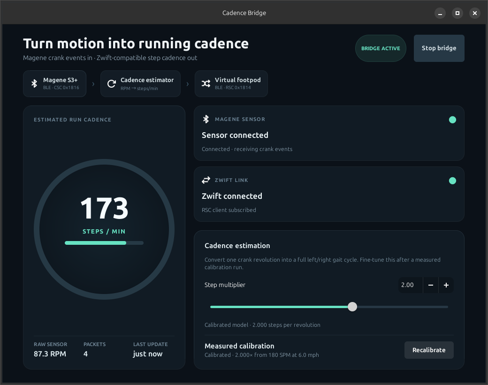

# Magene → Zwift Cadence Bridge

A native Linux application that reads a Magene cycling cadence sensor and publishes an estimated running cadence for Zwift Run.

The application includes a BlueZ-based CSC sensor client, a virtual RSC footpod publisher, and a demo backend that exercises every visual state without requiring hardware.



## Run

```bash
./run.sh --demo
```

Run without `--demo` to use the real Magene sensor and virtual footpod backends:

```bash
./run.sh
```

Start immediately with calibration armed:

```bash
./run.sh --auto-start --calibrate
```

The application uses the system GTK 4 and Libadwaita packages already available on Ubuntu.

On Debian or Ubuntu, install the runtime dependencies with:

```bash
sudo apt install bluez python3-dbus python3-gi gir1.2-gtk-4.0 gir1.2-adw-1
```

## Private local configuration

Copy `config/vps.example.json` to
`~/.config/magene-zwift-bridge/vps.json`, then set the private HTTPS endpoint
and bearer token. Keep permissions at `0600`. Calibration results are stored
separately in `~/.config/magene-zwift-bridge/calibration.json`. Neither file
belongs in source control.

## Test

```bash
python3 -m unittest discover -s tests -v
(cd server && python3 -m unittest -v test_app.py)
```

## Architecture

- `model.py` — observable application state and connection-state enums
- `estimator.py` — configurable cycling-RPM to running-SPM estimator
- `controller.py` — orchestration plus backend protocols and demo backend
- `ui.py` — GTK/Libadwaita dashboard
- `backends/bluez.py` — BlueZ CSC reader and RSC peripheral publisher
- `backends/vps_relay.py` — authenticated HTTPS cadence publisher
- `server/app.py` — small WSGI relay API with freshness and client state

The virtual footpod advertises as `RUN CADENCE BRIDGE` and remains available if the Magene sleeps or temporarily disconnects. It sends a one-second measurement heartbeat so Zwift does not treat a quiet sensor as a lost connection. Do not pair Zwift directly to the physical S3+ because it allows only one Bluetooth client.

## Bluetooth hardware

The app supports separate Bluetooth controllers for the two required roles:

- Input/central controller → connects to the physical Magene sensor
- Output/peripheral controller → advertises the virtual footpod to Zwift

Use a central-capable Linux Bluetooth controller for the physical sensor. The
Linux app publishes fresh cadence to the configured authenticated HTTPS API.
The Android dashboard polls that API independently and advertises the virtual
footpod to Zwift, so no USB connection or shared local network is required.

The VPS expires cadence after four seconds. The Android client publishes zero
when the Linux feed is stale, reports its own and Zwift's connection state back
to the API, and runs its BLE bridge in a foreground service that starts after
reboot.

The Zwift indicator represents a BLE client subscribing to the virtual RSC measurement stream. BLE does not expose the client application's brand, so this is technically “RSC client connected,” presented as “Zwift link” in the UI.

The companion Android dashboard and BLE publisher live in the
[`ai-usage-monitor-android`](https://github.com/carlren/ai-usage-monitor-android)
repository.

## VPS deployment

Run `server/app.py` behind Gunicorn with exactly one worker, using a random bearer
token supplied through `CADENCE_BRIDGE_TOKEN`. A generic systemd unit is provided
at `server/cadence-bridge.service.example`. Reverse proxy the service through HTTPS
and configure the resulting `/api` URL independently on Linux and Android.

Generate a token locally with a cryptographically secure tool such as:

```bash
openssl rand -hex 32
```

Do not commit the token, production hostname, device identifiers, calibration
measurements, private usernames, or deployment paths.
